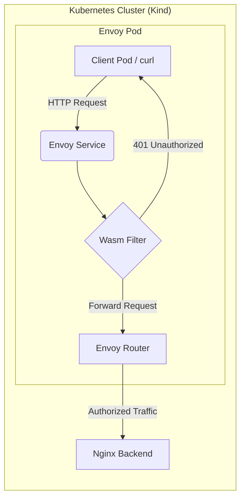
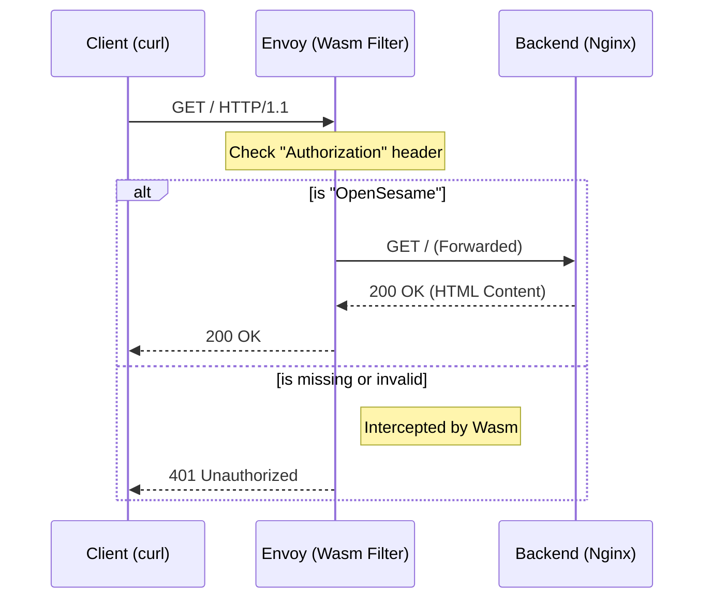
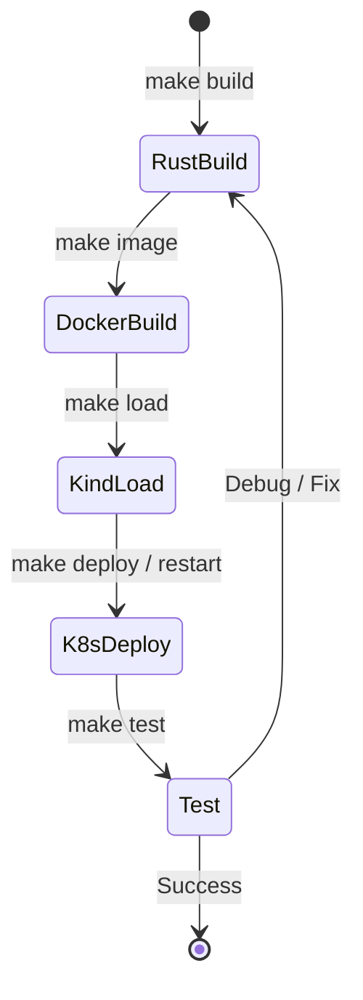

# Envoy Wasm Auth Filter on Kubernetes (Kind)

- [Envoy Wasm Auth Filter on Kubernetes (Kind)](#envoy-wasm-auth-filter-on-kubernetes-kind)
  - [System Architecture](#system-architecture)
  - [Request Logic Flow](#request-logic-flow)
  - [Prerequisites](#prerequisites)
  - [Getting Started](#getting-started)
    - [1. Development Lifecycle](#1-development-lifecycle)
    - [2. Basic Commands](#2-basic-commands)
  - [Verification (Quick Testing)](#verification-quick-testing)
    - [❌ Test A: Unauthorized Access](#-test-a-unauthorized-access)
    - [✅ Test B: Authorized Access](#-test-b-authorized-access)
  - [Debugging \& Logs](#debugging--logs)

This repository contains a custom **WebAssembly (Wasm) HTTP Filter** built with **Rust** for **Envoy Proxy**. It demonstrates how to implement a high-performance authentication gatekeeper in a cloud-native environment using Kubernetes.

## System Architecture

The following diagram illustrates the request flow within the Kubernetes cluster:



## Request Logic Flow

The Wasm filter acts as a security interceptor. Here is the decision logic implemented in Rust:



## Prerequisites

- **Rust**: `wasm32-wasip1` target installed.
- **Docker & Kind**: For local Kubernetes testing.
- **kubectl**: To manage cluster resources.
- **make**: For task automation.

## Getting Started

### 1. Development Lifecycle

We use a `Makefile` to automate the complex cycle of compiling Rust, building Docker images, loading them into Kind, and recycling Pods.



### 2. Basic Commands

| Command | Description |
| --- | --- |
| `make` | **Full Cycle**: Build Wasm, Build Image, Load to Kind, and Restart Pod. |
| `make build` | Compile the Rust code to `.wasm`. |
| `make deploy` | Apply all Kubernetes manifests (Nginx, Envoy, Client). |
| `make test` | Run automated `curl` tests for both 401 and 200 cases. |
| `make clean` | Remove build artifacts and delete K8s resources. |

## Verification (Quick Testing)

You can run `make test` or manually execute these one-liners:

### ❌ Test A: Unauthorized Access

```bash
kubectl run curl-test --image=curlimages/curl --rm -it --restart=Never -- \
  curl -i http://envoy-service/
```

### ✅ Test B: Authorized Access

```bash
kubectl run curl-test --image=curlimages/curl --rm -it --restart=Never -- \
  curl -i -H "Authorization: OpenSesame" http://envoy-service/
```

## Debugging & Logs

If the filter panics or fails to start, check the logs of the specific containers:

```bash
# Watch Wasm logs & Envoy initialization
kubectl logs envoy-wasm -f

# Check if requests are hitting the backend Nginx
kubectl logs backend-nginx -f
```
